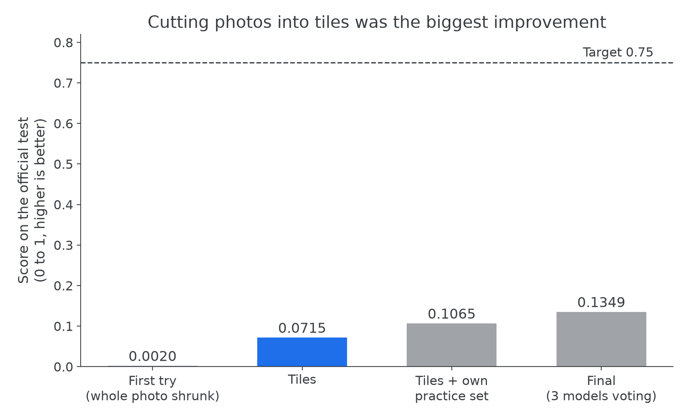
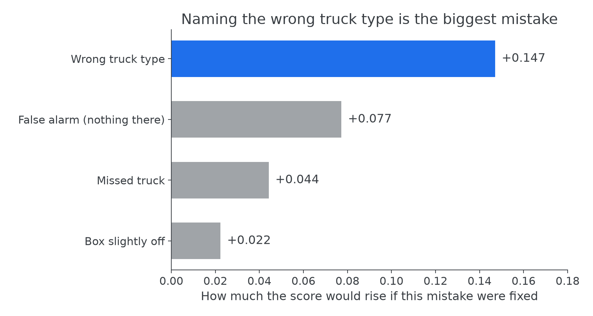
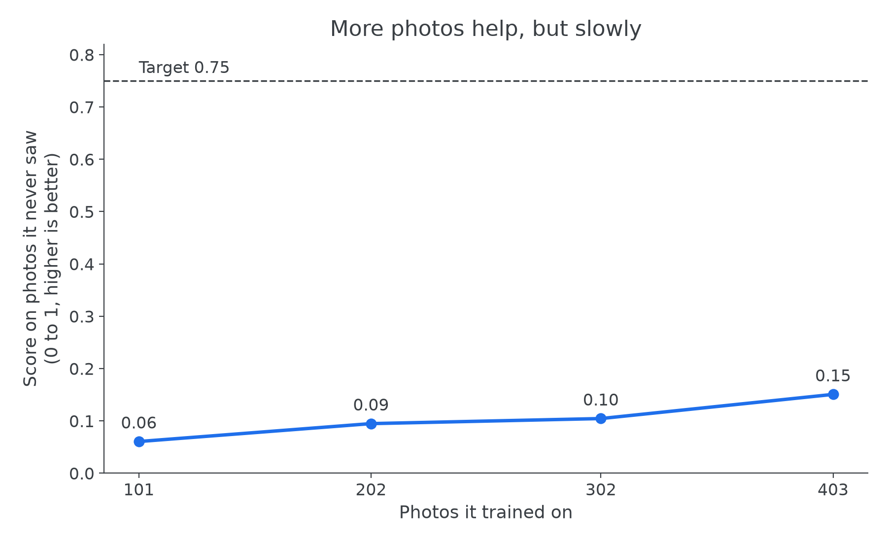
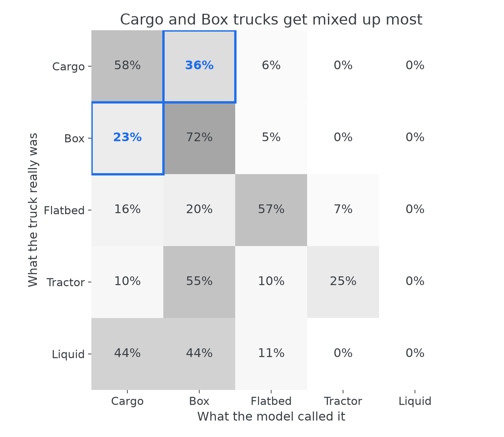
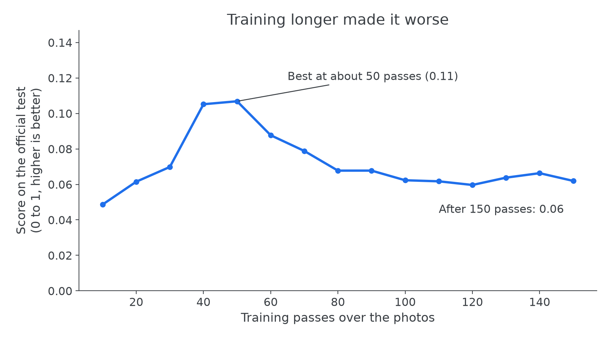
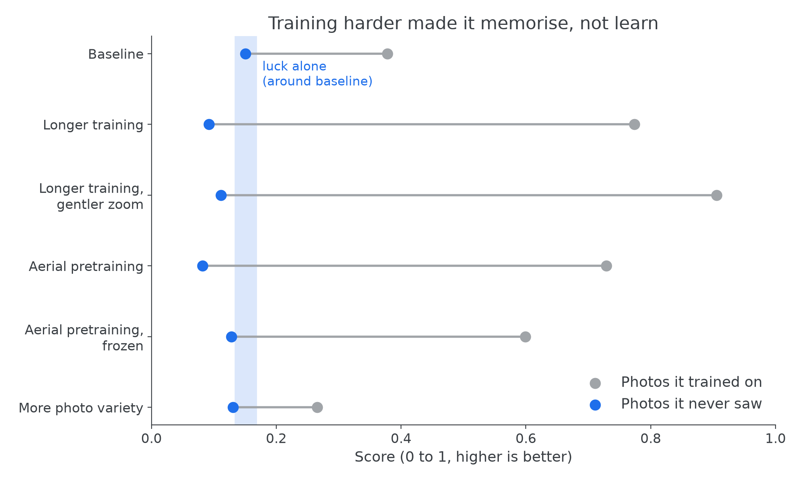

# Experiments: the 5-minute version 🚚

We built a computer program that looks at satellite photos and finds trucks, sorting each one into five types
(cargo, box, flatbed, tractor, liquid tanker). The goal was a score of 0.75 out of 1 on an official test of 22 photos.
We reached 0.13: far short of the goal, and this page explains, in plain words, what we tried and why it fell short.

> **Words we use**
> - **Score:** how well the program finds and names trucks, from 0 (nothing right) to 1 (perfect).
> - **Official test:** the 22 photos we were given to be judged on. We never trained on them or used them to choose
>   anything.
> - **Practice test:** 40 of our own training photos we held back, so we could check progress without peeking at the
>   official test.
> - **Tiles:** smaller squares cut from each big photo, so the trucks stay full size.
> - **Model:** one trained copy of the program.
> - **Training passes:** how many times the model has looked through all its training photos.
> - **Luck alone:** how much a score moves just by chance when we train the same model twice. On the practice test it
>   is about 0.02, so smaller differences mean nothing.
> - **Three models voting:** three models look at each photo and their answers are combined.

The full evidence, sources and caveats are in [REPORT.md](REPORT.md) and [DETAILED_EXPERIMENTS.md](DETAILED_EXPERIMENTS.md).
Run codes in brackets, like (E1), point to the matching entries there.

*Notice the jump from the first try to tiles, and how far every bar stays from the dashed 0.75 target.*

## The cast
- 🧑 **Aradhya** decides, runs and directs.
- 💬 **Claude chat** plans experiments.
- 🤖 **Claude Code** writes the code, runs the analyses and drives the Kaggle machines.

Aradhya made the decisions: what to run, what to stop, and which conclusions to accept. Who suggested and who
decided each step is recorded in [DETAILED_EXPERIMENTS.md](DETAILED_EXPERIMENTS.md), and the AI-assistance note is in
REPORT.md.

---

## 1. Looking inside the box

### First try: run it on the whole photo (B0)
- **What we tried:** shrink each big satellite photo to a small square and let a standard truck-finder have a go.
- **Why:** it's the obvious starting point.
- **What happened:** it scored 0.00, which is a polite way of saying "nothing".
- **What it means:** shrunk that far, a truck is just a few dots. The problem was the picture size, not the program.

### Cut the photos into tiles (B1)
- **What we tried:** cut every photo into full-size tiles and stitch the answers back together.
- **Why:** shrinking had erased the trucks.
- **What happened:** the score jumped from 0.00 to 0.07, the biggest single improvement of the whole project.
- **What it means:** it now finds trucks, but mostly names them wrong, which raised a new question: is the official
  test just unusually hard?

### Hold back a practice test (B1h)
- **What we tried:** hide 40 training photos from the model and use them as a practice test.
- **Why:** to see whether the official test is special, without peeking at it.
- **What happened:** it scored 0.38 on photos it trained on, 0.15 on the practice test and 0.11 on the official test.
- **What it means:** the main problem is coping with photos it hasn't seen; the official test is a bit harder on top.
  This model became our baseline.

*Notice that naming the wrong truck type costs far more than missing trucks or drawing the box slightly off.*

### 🚩 Sanity checks: can it even learn its own homework?
- **What we tried:** check the settings, draw the labels on the tiles, and ask the model to memorise just 16 tiles.
- **Why:** 0.38 on its own training photos looked suspiciously low.
- **What happened:** it learned the 16 tiles perfectly. A label alarm turned out to be a bug in the checker itself.
- **What it means:** the setup works; we overrode the "NOT PASS" and moved on.

### Would more photos help?
- **What we tried:** train on a quarter, half, three quarters and all of our photos.
- **Why:** to estimate what more labelled photos would be worth.
- **What happened:** the score kept rising, but slowly. 500 extra labelled trucks would add about 0.01, which is
  smaller than luck alone.
- **What it means:** more photos of the same kind won't carry us to 0.75.

*Notice the line is still rising, but it would need far more photos than we have to get anywhere near 0.75.*

### Is half the photos enough?
- **What we tried:** pick half and three quarters of the photos cleverly, and compare with random picks of the same
  size.
- **Why:** the brief asks for the smallest set that keeps 90% of the score.
- **What happened:** no smaller set kept 90%; the clever picks found more trucks, but they also just had more trucks
  in them.
- **What it means:** the smallest set that worked is all 403 photos.

### If it always found the truck, would it name it right?
- **What we tried:** give the model each true truck location and only ask for the type.
- **Why:** to separate "finding" from "naming".
- **What happened:** it named 60% correctly on the official test, against 52% for always guessing "cargo". On the
  practice test the gap was much bigger (69% vs 44%).
- **What it means:** naming is decent on photos like the training set and weak on the official test.

*Notice the two highlighted squares: cargo and box trucks are mistaken for each other far more than anything else.*

### Which trucks does it struggle to learn?
- **What we tried:** follow every training truck through training and sort them into "learned early", "learned
  late", "forgotten" and "never found".
- **Why:** "hard examples" isn't an explanation; we wanted the reason.
- **What happened:** we wrote five predictions from half the photos and all five held on the other half. Most
  "never found" trucks do get a guess, just an unconfident one.
- **What it means:** they are mostly small trucks the model isn't sure about, not invisible ones.

### Longer training (E1, E2): maybe it just needed more time?
- **What we tried:** train three times as long, once as is (E1) and once with gentler zooming (E2).
- **Why:** the model still seemed to be improving when training stopped.
- **What happened:** both got much better on photos they trained on and worse on the practice test (0.15 down to
  0.09).
- **What it means:** it was memorising, not learning. The question became "how do we stop it memorising?"

*Notice the score on the official test peaks after about 50 passes and then falls as training goes on (E2).*

### ✅ Did we cheat without noticing?
- **What we tried:** audit every reported number for any hidden use of the official test.
- **Why:** a quiet leak would make every score meaningless.
- **What happened:** one leak: a default setting that stopped training early by watching the official test.
- **What it means:** it is switched off in every run since.

### Aerial pretraining or more photo variety? (E3, E4, E7)
- **What we tried:** start from a model already trained on aerial photos (E3), the same but with that knowledge
  frozen (E7), or show more varied copies of each photo (E4).
- **Why:** to stop the memorising.
- **What happened:** aerial pretraining memorised even faster; freezing recovered most of that loss; more variety
  memorised least and found more trucks but named them slightly worse. None beat the baseline.
- **What it means:** the model's starting point and photo variety are not the main limit.

*Notice that every attempt moving the grey dot right (better on its own photos) moved the blue dot left or kept it
inside the "luck alone" band.*

### Second opinions at test time
- **What we tried:** look at each tile four ways and combine the answers, or ask a separate truck-type classifier.
- **Why:** if the model is unsure, maybe asking twice helps.
- **What happened:** both made things slightly worse; the separate classifier named 61% of trucks right against the
  model's own 69%.
- **What it means:** neither second opinion knew more than the first.

### Does even the baseline over-train?
- **What we tried:** score the baseline's saved snapshots on the practice test.
- **Why:** to check whether it already trains too long.
- **What happened:** flat from 40 to 50 passes.
- **What it means:** the baseline stops about where it should.

### Show the rare trucks more often (E6, E6b)
- **What we tried:** repeat the tiles that contain rare truck types.
- **Why:** rare types score worst.
- **What happened:** the first try changed almost nothing; the second showed rare tiles 18% more often, and the rare
  types did not improve.
- **What it means:** rare types are weak, but not just because they are rare.

### More photo variety, for longer (E8, stopped)
- **What we tried:** the "more variety" recipe for twice as long.
- **Why:** it was still slowly improving.
- **What happened:** we stopped it after 68 of 100 passes to save computing budget.
- **What it means:** no result.

---

## 2. Stepping outside the box

### Why is the official test harder than our practice test?
- **What we tried:** compare how many trucks it finds on each, at matched truck size, crowding and photo size.
- **Why:** it found 67% of trucks on the official test but 85% on the practice test.
- **What happened:** truck size, crowding and photo size explained almost none of it. Brightness and contrast each
  explained about a third, and these overlap.
- **What it means:** the official test's photos themselves look different; the rest of the gap is unexplained.

### 🔍 Are the false alarms really false?
- **What we tried:** look at the 60 most confident "false alarms".
- **Why:** some looked suspiciously like trucks.
- **What happened:** 46 of the 60 looked like real trucks that simply had no label.
- **What it means:** the score punishes the model for some correct finds.

### 🕵️ The xView reveal
- **What we tried:** compare every photo with a public satellite dataset (xView) whose names looked familiar.
- **Why:** to learn where the data came from.
- **What happened:** all our photos come from it. Most of the "false alarms" sit on truck types the dataset leaves
  out (216 of 350).
- **What it means:** many "false alarms" are real trucks of types we weren't asked to find.

### 🧪 How the dataset was built
- **What we tried:** compare every photo and label with its public original.
- **Why:** to see what changed.
- **What happened:** 8 of the 22 official test photos were altered: four resized, two given noise or blur, two with
  changed contrast. About 5% of training labels name a different truck type than the original.
- **What it means:** the official test is partly a test of altered photos. We found this only by comparing with the
  public originals; the official test was never used to train or choose anything.

### 👀 An independent visual review
- **What we tried:** Claude chat looked through the official test photos without seeing our conclusions first.
- **Why:** a fresh pair of eyes.
- **What happened:** it saw dark, hazy and blurry photos, and cargo vs box labels that look inconsistent.
- **What it means:** this matches the measurements above.

---

## 3. Fixing what we found

### Teach it the look-alikes (E10)
- **What we tried:** train with the left-out truck types as extra types that never count, plus 202 extra photos.
- **Why:** most false alarms were those look-alikes.
- **What happened:** false alarms on the official test halved, but the score didn't rise.
- **What it means:** fewer false alarms alone doesn't fix the score. Some extra photos also sat next to test scenes,
  so we kept it out of the final system.

### Use the original labels (E15)
- **What we tried:** train on the public dataset's original labels instead of the ones we were given.
- **Why:** about 5% of our labels differ.
- **What happened:** it scored lower, not higher.
- **What it means:** those label differences are not what holds it back.

### Adjust for resized photos (E12)
- **What we tried:** guess each photo's scale from the size of what it finds, and resize before looking.
- **Why:** four official test photos were resized.
- **What happened:** on the practice test the gain was too small to tell from luck; on the official test it dropped
  (0.09 vs 0.11).
- **What it means:** truck sizes vary as much between normal photos as resizing changes them, so the rule couldn't
  tell which photos were resized.

### 🏁 The final system: three heads are better than one (E13)
- **What we tried:** let three existing models vote, and let each truck keep its top few type guesses.
- **Why:** nothing beat the baseline alone, and the right type is in the top two guesses most of the time.
- **What happened:** on the practice test it beat the baseline by more than luck alone; on the official test it
  reached 0.13, up from 0.11.
- **What it means:** it's our best system, though still far from 0.75. It reproduces exactly from the published files.

### Bigger trucks on screen (E16)
- **What we tried:** enlarge each tile 2× so small trucks look twice as big.
- **Why:** many trucks are tiny.
- **What happened:** alone it scored below the baseline; added as a fourth voter, the gain was within luck alone.
- **What it means:** simple enlarging doesn't help; the final system is unchanged.

---

## What we didn't try
A bigger model, a different kind of truck-finder, special tricks for rare types, or training each model several
times. Mostly this was down to computing budget (one graphics card, about 30 hours a week). We also refused a
shortcut on principle: models pretrained on xView would already have seen the official test's answers.

## Plot twists & roadblocks 🎢
- ⏱️ **Google Colab's free tier was too short** for our runs (Aradhya's screenshot), so everything moved to Kaggle,
  driven from the command line.
- 🧟 **Stale code.** Kaggle ran an older copy of our code more than once; a guard now stops any run whose
  code is out of date.
- 🐛 **The label checker cried wolf.** It flagged 85 tiles because of its own bug. After the fix: zero.
- ⏹️ **Training stopped itself early**, thanks to a default setting quietly watching the official test. Found, and
  switched off.
- 🔢 **"500 trucks" isn't "500 photos".** Our first estimate answered the wrong question; the right answer is still
  below luck alone.
- 🧮 **The budget squeeze** forced us to stop one run and cancel two.
- 🎯 **"Can we reach 0.7?"** Aradhya asked. The best published result on a similar xView task is about 0.31.
- 🏃 **"Keep going nonstop."** Aradhya's call, which is why there are so many small experiments.
- 🤝 **AI-assistance disclosure.** Flagged by Claude chat, approved by Aradhya.

## What we would do next
Relabel the 62 test photos properly, marking the left-out truck types as "don't count" so correct finds stop being
punished. This is cheap and needs no new training. It would make future comparisons fair, though it is expected to
raise the score only by about 0.02–0.03.

Full evidence: [REPORT.md](REPORT.md) · [DETAILED_EXPERIMENTS.md](DETAILED_EXPERIMENTS.md)
