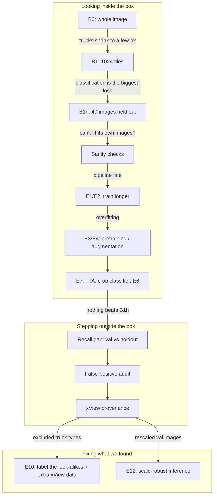
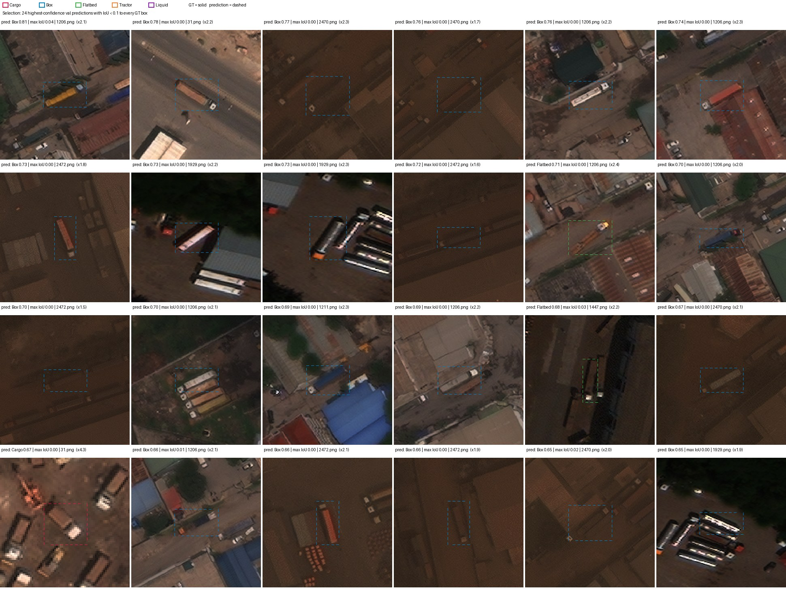

# Experiments: the 5-minute version 🚚

> This is the story version. Every number here comes from [DETAILED_EXPERIMENTS.md](DETAILED_EXPERIMENTS.md), which has
> the sources, the pre-registrations and all the caveats.

## TL;DR
We set out to hit 0.75 mAP50 on val; our best model, B1h, reached 0.107 (the same recipe with another seed: 0.063).
For a long time we looked inside the model. Every attempt to make it fit its training images better made it memorise
them and do worse on new images. It names truck types reasonably on our own held-out images (69% right vs 43.5%
for always guessing "Cargo") but much worse on val (60% vs 52%) *(corrected 2026-10-04: previously "it never learned
to tell look-alike truck types apart")*. Then we stepped outside
the box and found that the data itself was part of the story: every image is from xView, four val images are
rescaled copies, and most of the model's "false alarms" are real trucks of types the labels leave out. The last two
experiments (E10 and E12) try to fix exactly that.

## The cast
- 🧑 **Aradhya** decides, runs and directs.
- 💬 **Claude chat** plans experiments.
- 🤖 **Claude Code** writes the code, runs the analyses and drives the Kaggle kernels.

## How this was done
This project was planned in dialogue with **Claude (chat)**, which proposed most experiments and analyses, wrote the
first versions of the hypotheses and caught several mistakes. **Claude Code** wrote the code, ran every analysis
and drove the Kaggle kernels. **Aradhya** made the decisions: what to run, what to stop, and which conclusions to
accept. Who suggested and who decided each individual step is recorded per entry in
[DETAILED_EXPERIMENTS.md](DETAILED_EXPERIMENTS.md), and the AI-assistance disclosure is in REPORT.md.

Aradhya's own key calls:
- **Overriding the sanity "NOT PASS"** so the work could move on (recommended by Claude chat, decided by Aradhya).
- **Asking whether resampling and augmentation would help**, which led to E6/E6b and TTA.
- **Pushing for 0.7 and for xView-based data**, which led to the xView check and E10.
- **Requesting an independent visual inspection of val.**
- **The inside-the-box / outside-the-box framing** of the whole project.
- **Deciding what to stop for budget:** E8 stopped; E9 and E11 cancelled.

## Journey map

## Scoreboard

The further right a run sits, the better it fits the images it trained on; the higher it sits, the better it does on
images it has never seen. Moving right never moved anyone up past B1h.

---

## 1. Looking inside the box

### B0: just run YOLO on the whole picture
We started the obvious way: squeeze each ~3000 px satellite image down to 640 px and let a standard detector have
a go. It scored 0.002 mAP50 on val, which is a polite way of saying "nothing". At 640 px a 22 px truck shrinks to a
few pixels, and there's simply nothing left to detect. So the first lesson was about resolution, not about the model.
*[details →](DETAILED_EXPERIMENTS.md#b0-naive-full-image-baseline-configsb0yaml-run-b0_full640)*

### B1: cut the image into native-resolution tiles
Since shrinking killed the trucks, we stopped shrinking. We cut every image into 1024 px tiles at full resolution
and stitched the predictions back together. That took val from 0.002 to 0.0715, a big jump, but far below the
0.40–0.60 Aradhya had pre-registered. The error analysis said the biggest loss was naming the wrong truck type, not
missing trucks, which raised a new question: is val just unusually hard?
*[details →](DETAILED_EXPERIMENTS.md#b1-native-resolution-tiled-baseline-configsb1yaml-run-b1_tile1024)*

### B1h: hold out 40 training images as a second exam
To find out whether val was special, we hid 40 training images from the model and used them as a second test set
(holdout40). The model scored 0.378 on images it had trained on, 0.151 on the hidden ones and 0.107 on val. So the
main problem was generalising to new images, not val in particular. B1h became our reference model, and it still is.
*[details →](DETAILED_EXPERIMENTS.md#b1h-b1-with-40-train-images-held-out-configsb1hyaml-run-b1h_tile1024_holdout40)*

### 🚩 Sanity checks: can it even learn its own homework?
Claude chat spotted a red flag: 0.38 on its own training images is low. So before going further we checked the
settings, drew the labels on the tiles, and asked the model to memorise just 16 tiles. It reached 1.000 AP on them,
so the pipeline and the model can learn. The label check raised an alarm that turned out to be a bug in the
checker itself (more under Plot twists). We overrode the "NOT PASS" and moved on.
*[details →](DETAILED_EXPERIMENTS.md#sanity-why-does-b1h-reach-only-038-map50-on-its-own-training-images-kernel-aradhya1211auric-sanity-code-f2388f1)*

### Learning curves: would more labels help? (§5.3)
We trained on 25, 50, 75 and 100% of the images with the same number of training steps. The curve was still rising
at 100%, so more data helps, but slowly. Asked the way the brief asks it, 500 more labelled instances project to
about +0.006, below the run-to-run noise, and no single class gains reliably above noise either. More labels from the
same source won't carry us to 0.75.
*[details →](DETAILED_EXPERIMENTS.md#lc-learning-curves-53-runs-b1h_f25--b1h_f50--b1h_f75--b1h_seed1)*

### Smart subsets: is half the data enough? (§5.4)
We picked half and three quarters of the images cleverly (cover every class, then maximise variety) and compared
them with random picks of the same size. No subset reached 90% of full-data performance, on holdout40 or on val, so the smallest successful subset we
tested is the full training set (403 images).
The smart subsets did find more trucks, but it turned out they also simply contained more labelled boxes, so we
can't credit the cleverness.
*[details →](DETAILED_EXPERIMENTS.md#s54-smart-vs-random-subsets-54-runs-b1h_smart50--b1h_smart75--b1h_f50_seed1--b1h_f75_seed1)*

### If every location were perfect (§5.1)
How much of the problem is just naming the truck? We read the model's class scores right at each true box, so
finding the truck was taken out of the equation. It named the type correctly 60% of the time, versus 52% for
always answering "Cargo". On our own 40 held-out images the same model gets 69% right against 43.5% for "Cargo",
a much bigger margin. So naming is decent on images like the training set and collapses mainly on val, which fits
what we later found about val (rescaled images, changed classes).
*[details →](DETAILED_EXPERIMENTS.md#51-if-locations-were-perfect)*

### Which training examples resist learning? (§5.2)
We followed every training box across checkpoints and sorted them into "learned early", "learned late",
"forgotten" and "never detected". Claude Code wrote down five claims from one half of the images, and all five held
on the half nobody had looked at. The most telling one: about 78% of the "never detected" boxes do get a box from
the model, just with low confidence. They are mostly small trucks the model isn't sure about, not invisible ones.
*[details →](DETAILED_EXPERIMENTS.md#52-test-half-confirmation-results-4-oct-2026-cpu-only-kernel-aradhya1211auric-s52-confirm-v2-code-95953f3)*

### E1 / E2: maybe it just needed more time?
B1h's training loss was still falling at epoch 50, so the obvious suspect was that it simply hadn't finished learning.
We trained for three times as long (E1), and in a second run also toned down the zoom augmentation that can shrink
small trucks even further (E2). Both models got dramatically better at their own training images (0.38 → 0.77 and
0.91) but worse on images they had never seen (holdout40 fell from 0.151 to 0.092 and 0.111). That's the classic
signature of overfitting: the model was memorising, not learning. So the question changed from "how do we train
more?" to "how do we stop it memorising?"
*[details →](DETAILED_EXPERIMENTS.md#e1--e2-results-4-oct-2026)*

### ✅ CHECK 0: did we cheat without noticing?
Before trusting any of this, we audited every reported number to make sure none came from a checkpoint picked on
val. All of them use the last checkpoint, as planned. The one leak we found was Ultralytics' default early stopping,
which quietly watched val and stopped E1 at epoch 145. It is switched off in every run since.
*[details →](DETAILED_EXPERIMENTS.md#check-0-4-oct-2026-which-weights-produced-the-reported-scores)*

### E3 / E4: aerial pretraining or more augmentation?
To fight the memorising we tried two remedies. E3 started from weights pretrained on aerial imagery (DOTA); E4 added
vertical flips and image mixing. E3 memorised even faster and dropped to 0.082 on holdout40. E4 overfitted much
less and found more trucks, but named them slightly worse, ending at 0.130 against B1h's 0.151. Part of that gap is
one rare class: Truck w/Liquid has only 29 holdout boxes and dropped to zero.
*[details →](DETAILED_EXPERIMENTS.md#e3-results-4-oct-2026-gpu-kernel-aradhya1211auric-e3-dota-code-734299d-164-gpu-h-kernel-time)*

### E7: aerial weights, but frozen
Maybe E3 overwrote its useful aerial features while memorising? E7 kept them frozen and trained only the rest of the
network. That recovered a lot of E3's loss (holdout40 0.128 vs 0.082), but it still didn't beat B1h, just as
predicted. Freezing helps, but it isn't a win.
*[details →](DETAILED_EXPERIMENTS.md#e7-results-4-oct-2026-gpu-kernel-aradhya1211auric-e7-dota-frozen-code-e5a115e-120-gpu-h-kernel-time)*

### TTA and the crop classifier: second opinions at test time
If the model is unsure, maybe asking it twice helps. Test-time augmentation looked at each tile four ways (original,
two flips, an upscale), and every extra view lowered the score, mostly through Liquid (0.138 vs 0.151). A separate
classifier trained on truck crops was 61% accurate on the 738 held-out truck boxes, worse than the detector's own
head on the very same boxes (69%), and re-labelling with it lowered holdout40 to 0.100–0.117. Neither second opinion knew more than the first.
*[details →](DETAILED_EXPERIMENTS.md#tta-on-b1h-results-4-oct-2026-cpu-only-kernel-aradhya1211auric-tta-b1h-code-095cf9b) · [details →](DETAILED_EXPERIMENTS.md#crop-classifier-on-b1hs-holdout40-detections-4-oct-2026-cpu-only-kernel-aradhya1211auric-fp-crop-code-734299d)*

### Does even B1h overfit?
We scored B1h's own saved checkpoints on holdout40. It climbs to 0.154 at epoch 40 and sits at 0.151 at epoch 50:
flat, no clear peak. So B1h stops about where it should; overfitting only shows up when training goes longer or
faster.
*[details →](DETAILED_EXPERIMENTS.md#b1h-holdout40-checkpoint-curve-descriptive-4-oct-2026-cpu-only-kernel-aradhya1211auric-b1h-holdout-curve-code-e5a115e)*

### E6 and E6b: show the rare trucks more often
Rare classes are weak, so we repeated the tiles that contain them. The first try (E6) used a threshold so low that
only Liquid tiles were repeated, adding just 1.6% more tile views: too weak to test anything. E6b raises the
threshold so Tractor, Flatbed and Liquid tiles are all shown more often (+17.9% views). Its result is still pending.
*[details →](DETAILED_EXPERIMENTS.md#e6b-repeat-factor-sampling-with-t--03-pre-registered-4-oct-2026-before-launch-configse6b_b1h_rfs_t03yaml)*

### E8: E4 for longer (stopped)
E4 was still slowly improving at epoch 50, so E8 trained the same recipe for 100 epochs. We stopped it at epoch 68
to free GPU budget for E10 and E12. It counts as stopped, not as a result.
*[details →](DETAILED_EXPERIMENTS.md#budget-decisions-author-4-oct-2026-1630-ist)*

---

## 2. Stepping outside the box

### Why is val harder than our own hidden images?
The same model finds 0.665 of val trucks but 0.852 of holdout40 trucks. We compared them at matched truck size,
crowding and image size, and none of those explained the gap; box size explained just 3% of it. The difference is in
the scenes themselves, which pushed us to look at the data instead of the model.
*[details →](DETAILED_EXPERIMENTS.md#val-vs-holdout40-recall-gap-4-oct-2026-cpu-only-kernel-aradhya1211auric-recall-gap-code-cc152a5)*

### 🔍 Are the false alarms really false?
We looked at the 60 most confident predictions that matched no label. 46 of them looked like real, unlabelled
trucks. Either our five classes were missing from the labels, or these were truck types the dataset leaves out, and
the crops alone couldn't tell which. Either way, the score was punishing the model for finding real vehicles.
*[details →](DETAILED_EXPERIMENTS.md#background-false-positive-audit-4-oct-2026-cpu-only-kernel-aradhya1211auric-fp-crop-code-734299d)*

### 🕵️ The xView reveal
The image names looked familiar, so we compared every image with the public xView dataset. All 465 of our images
are xView training images, and four of the val images are exact 2× or 0.5× rescaled copies, which explains their
strange sizes. The labels are xView's own boxes, filtered to five classes (99.6% pair up), with a small share of
changed classes. Most tellingly, 216 of B1h's 350 confident holdout40 "false positives" sit on xView boxes of truck
types our dataset excludes, mostly xView's generic "Truck". Most of these "false alarms" are real trucks of types
outside the five classes, so the metric counts them as errors.
*[details →](DETAILED_EXPERIMENTS.md#e10-steps-13-xview-overlap-label-comparison-extra-data-fp-re-scoring-4-oct-2026-cpu-only-kernel-aradhya1211auric-xview-overlap-v2-code-59ef959)*

### 🧪 How the dataset was built
Comparing every image and label with its public xView original showed how this dataset was put together. All 443
training and holdout images are byte-for-byte xView, but 8 of the 22 val images were altered:
- four were rescaled: 2308 and 2391 by 2×, 2384 and 2460 by 0.5×;
- one had noise added (2292);
- one was blurred and noised (2543);
- one had its contrast halved (1399);
- one had its contrast boosted (2139).

The dark port images 2470 and 2472 are untouched; they are just dark. The labels show the opposite pattern. About 5%
of training boxes carry a different class than xView, mostly Cargo or Box turned into Flatbed, Tractor or Liquid,
and 378 are shifted. Val keeps xView's classes exactly but leaves out 178 of its boxes (10.3%). That also hints at why
showing rare classes more often (E6b) didn't help: some of those rare-class labels are relabelled Cargo and Box
trucks. We found all this by comparing with the public originals; val was never used to train or choose anything.
*[details →](DETAILED_EXPERIMENTS.md#data-integrity-audit-pixels-and-labels-vs-the-xview-originals-4-oct-2026-cpu-only-kernel-aradhya1211auric-xview-pixels-code-0c96e12-analysisxview_pixelspy)*

### 👀 An independent visual review
Claude chat went through the val inspection sheets without seeing our interpretation first. It saw labels that are
not shifted, Truck w/Box labels concentrated in two dark port images, Cargo vs Box looking inconsistent between
train and val, and several visibly degraded val images (dark, hazy, blurry, low-resolution). Claude Code is
reproducing the numbers behind each observation. Image quality, the trucks missed in one image and geographic
overlap with training images are being measured now.
*TODO-FINAL: link once the reproduction is in DETAILED_EXPERIMENTS.md*

---

## 3. Fixing what we found

### E10: teach the model the look-alikes ⏳
If most false alarms are excluded truck types, tell the model about them. E10 trains on our images plus 382 extra
xView images, with the excluded truck types as extra classes that never count at test time, and with val and the
holdout images strictly excluded. The extra images hold few of our five classes, so this is mainly a test of "label
the look-alikes". The learning curve predicts a gain right at the noise bar (about +0.019). Running now.
*[details →](DETAILED_EXPERIMENTS.md#e10-extra-xview-data-val-and-holdout40-excluded-pre-registered-4-oct-2026-before-launch-configse10_b1h_xview_extrayaml) · TODO-FINAL: result*

### E12: inference that adapts to scale ⏳
Four val images are rescaled 2× or 0.5×, so their trucks are far bigger or smaller than anything in training. E12
keeps B1h's weights and changes only inference. It either runs at three scales, or picks a scale per image from the
size of what it detects. The rule is chosen on rescaled copies of holdout40 and then applied to val exactly once.
Waiting for a GPU slot.
*[details →](DETAILED_EXPERIMENTS.md#e12-scale-robust-inference-no-training-pre-registered-4-oct-2026-before-any-run-analysise12_scalepy) · TODO-FINAL: result*

### The final model
The final candidate is E10's model with E12's inference, each only if it passes its own pre-registered test.
Otherwise it stays B1h with plain inference. TODO-FINAL.

---

## Plot twists & roadblocks 🎢
- ⏱️ **Colab's free tier was too short** for our runs (Aradhya's screenshot), so everything moved to Kaggle, driven
  from the command line, with CPU-only kernels for anything that didn't need a GPU (Claude chat's idea).
- 🧟 **Stale code, twice.** Kaggle once mounted an older version of our code. Then the first guard (Claude Code's)
  was too strict and rejected *newer* code, which cost E8 and E6 a launch each. The guard now checks only that the
  needed files exist.
- 🐛 **The label checker cried wolf.** It flagged 85 tiles because of a pairing bug, found by Claude Code. After
  the fix: zero.
- ⏹️ **E1 stopped itself at epoch 145**, thanks to Ultralytics' default early stopping quietly watching val. Claude
  Code found it, and it's been off ever since.
- 🔢 **"500 instances" isn't "500 images".** Our learning curve first answered the wrong question; Claude Code
  caught it while building the submission checklist. The answer to the right question is about +0.006, below noise.
- 📏 **§5.4 has to be judged on val**, per the brief (also caught by Claude Code). We report both versions, and
  neither finds a 90% subset.
- 🧮 **The GPU quota hold.** Running sessions reserve quota that the command line can't see, and the budget forced
  us to stop E8 and cancel E9 and E11.
- 🎯 **"Can we reach 0.7?"** Aradhya asked. Claude chat checked the published xView results: the best is 0.3065
  mAP over 19 small, similar xView classes (arXiv 2104.11854, Table IV).
- 🧭 **"Picking an epoch on holdout40 isn't test-set selection."** Claude chat's correction: holdout40 is our
  validation split. We still kept the last checkpoint, as pre-registered.
- 🏃 **"Keep going nonstop."** Aradhya's call, which is why there are so many small experiments.
- 🤝 **AI-assistance disclosure.** Flagged by Claude chat, approved by Aradhya.
