# Experiments: the 5-minute version 🚚

> The full log, with every number sourced, is [DETAILED_EXPERIMENTS.md](DETAILED_EXPERIMENTS.md). This page only
> summarises it. No number here is new.

## TL;DR
- 🎯 Target: **0.75** mAP50 on val. Best: **0.107** (B1h). **Not reached.**
- 🧩 Main reason: the model doesn't generalise from ~400 images. It memorises the training images, and it can't tell
  look-alike truck types apart (Cargo vs Box).
- 🔁 Every trick that made it fit the training images better made it worse on unseen ones.

## The cast
- 🧑 **Aradhya**: decides, runs, directs.
- 💬 **Claude chat**: experiment planning.
- 🤖 **Claude Code**: code, analysis, Kaggle kernels.

## Journey map
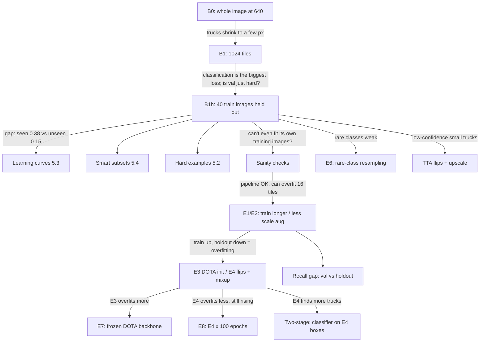

## Scoreboard: the overfitting story in one picture
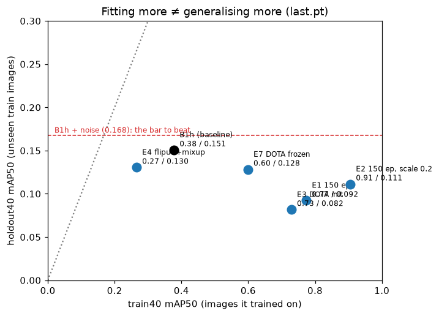

Further right means it fits its training images better; higher means it does better on unseen ones. Nothing beat
B1h's height.

---

## The cards (in time order)

### 1. B0: just run YOLO on the whole image
- ❓ Does a standard detector work out of the box?
- 💡 Planned in an earlier session · ✅ Aradhya
- 🔧 Whole ~3000 px image squeezed to 640 px.
- 📊 val mAP50 **0.002**.
- 🖼️ 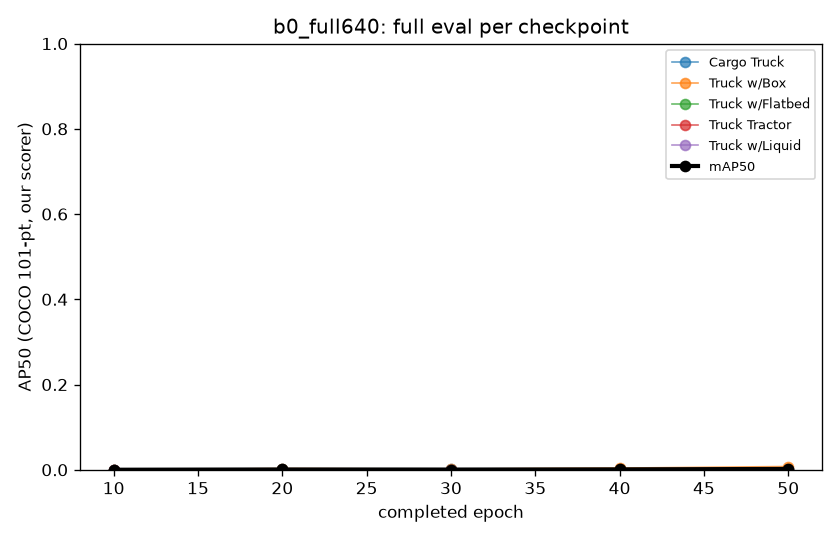
- 🧠 At 640 px a ~22 px truck becomes a few pixels. Almost nothing is detectable.
- ➡️ Cut the images into native-resolution tiles.
- 📖 Details → [B0: naive](DETAILED_EXPERIMENTS.md#b0-naive-full-image-baseline-configsb0yaml-run-b0_full640)

### 2. B1: native-resolution tiles
- ❓ Does keeping full resolution fix it?
- 💡 Planned in an earlier session; pre-registration written by Aradhya · ✅ Aradhya
- 🔧 1024 px tiles, sliced evaluation.
- 📊 val **0.0715**, against a predicted 0.40–0.60.
- 🖼️ 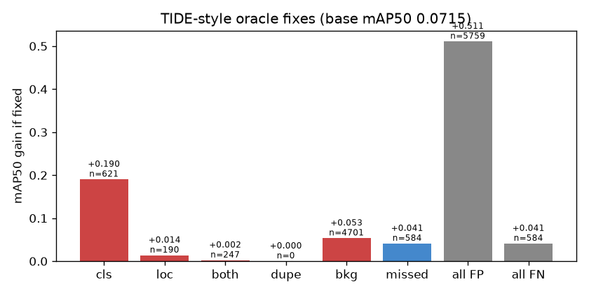
- 🧠 Classification errors are the biggest loss, as predicted. The score is far below the prediction.
- ➡️ Is val just unusually hard? Hold out some training images and see.
- 📖 Details → [B1: native](DETAILED_EXPERIMENTS.md#b1-native-resolution-tiled-baseline-configsb1yaml-run-b1_tile1024)

### 3. B1h: hold out 40 training images
- ❓ Is the problem val, or generalising in general?
- 💡 Planned in an earlier session · ✅ Aradhya
- 🔧 B1 minus 40 train images (holdout40), which the model never sees.
- 📊 Seen images **0.378** · unseen **0.151** · val **0.107**.
- 🖼️ 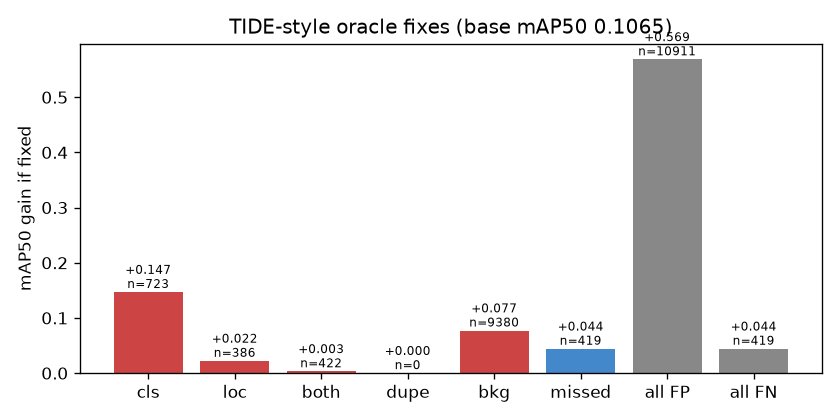
- 🧠 It's mostly a generalisation problem. B1h becomes our best model.
- ➡️ Learning curves, subsets, hard examples, and a sanity check.
- 📖 Details → [B1h: B1 with 40](DETAILED_EXPERIMENTS.md#b1h-b1-with-40-train-images-held-out-configsb1hyaml-run-b1h_tile1024_holdout40)

### 4. Learning curves (§5.3): would more labels help?
- ❓ Would 500 more labels matter?
- 💡 Planned in an earlier session; pre-registration written by Aradhya · ✅ Aradhya
- 🔧 Train on 25 / 50 / 75 / 100% of the images, with equal training steps.
- 📊 Still rising at 100%. **500 instances ≈ +0.006**, below noise. No single class gets a reliable gain above noise.
- 🖼️ 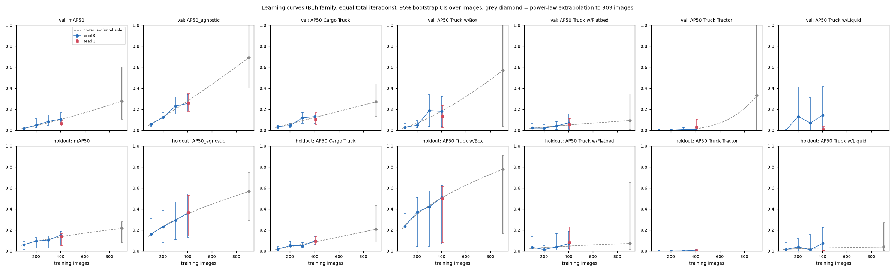
- 🧠 More data helps a little; it can't reach 0.75 alone.
- ➡️ The brief asks about *instances*, not images (see Plot twists).
- 📖 Details → [LC: learning curves](DETAILED_EXPERIMENTS.md#lc-learning-curves-53-runs-b1h_f25--b1h_f50--b1h_f75--b1h_seed1) · [per class](DETAILED_EXPERIMENTS.md#53-per-class-500-targeted-instances-4-oct-2026-cpu-only-kernel-aradhya1211auric-lc-per-class-code-095cf9b)

### 5. Smart subsets (§5.4): the smallest set that keeps 90%
- ❓ Can a cleverly chosen half of the data do as well as all of it?
- 💡 Planned in an earlier session (selection declared before training) · ✅ Aradhya
- 🔧 Smart (class coverage + diversity) vs random, at 202 and 302 images.
- 📊 **No subset reached 90%**, on holdout40 or on val.
- 🖼️ 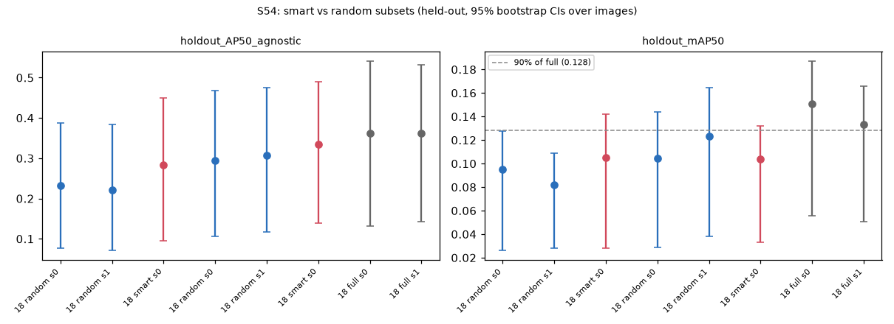
- 🧠 Smart subsets find more trucks, but they also simply contain more boxes. That's a confound.
- ➡️ Documented; larger fractions were not tested.
- 📖 Details → [S54: smart vs random](DETAILED_EXPERIMENTS.md#s54-smart-vs-random-subsets-54-runs-b1h_smart50--b1h_smart75--b1h_f50_seed1--b1h_f75_seed1)

### 6. §5.1: if every location were perfect
- ❓ How much of the problem is just naming the truck?
- 💡 Planned in an earlier session · ✅ Aradhya
- 🔧 Read the model's class scores directly at each true box.
- 📊 Right type **60%** of the time, vs 52% for always guessing "Cargo".
- 🖼️ 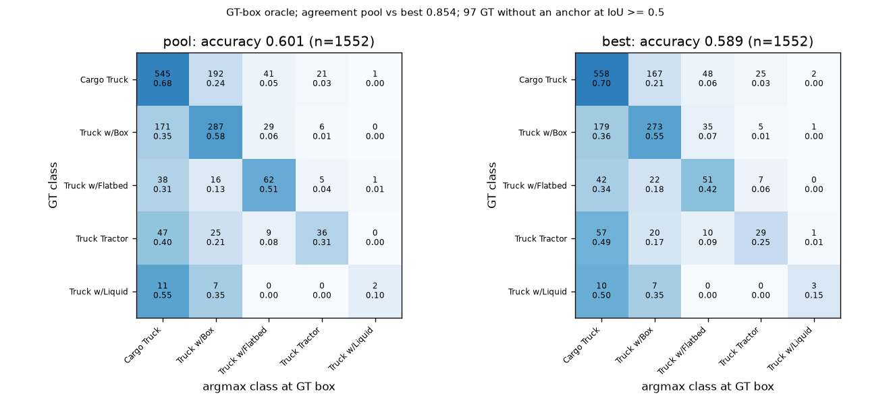
- 🧠 Classification is the ceiling, not localisation.
- 📖 Details → [§5.1 If locations](DETAILED_EXPERIMENTS.md#51-if-locations-were-perfect)

### 7. 🚩 Sanity checks: can it even learn its own training images?
- ❓ Red flag: train40 was only 0.38. Is something broken?
- 💡 Claude chat (red flag and plan: settings check, label renders, 16-tile overfit test) · ✅ Aradhya
- 🔧 Checked the effective settings, rendered the labels, and overfit 16 tiles.
- 📊 Overfit test reaches **1.000** AP50.
- 🖼️ 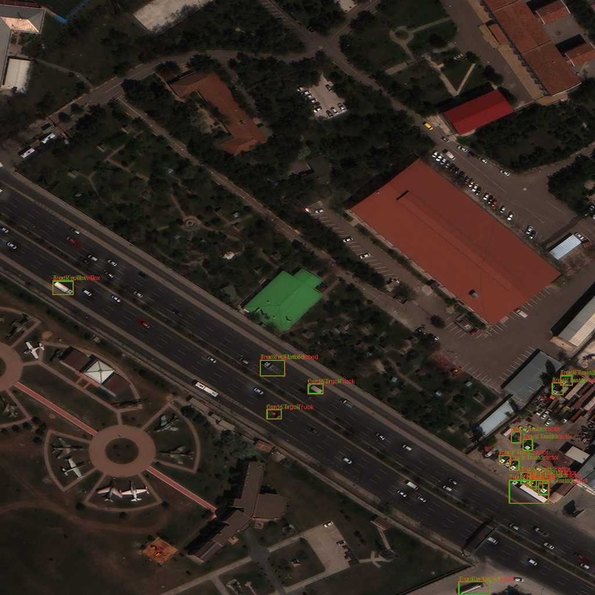
- 🧠 The pipeline and model can learn. The label check's alarm was a checker bug (see Plot twists).
- ➡️ Override the NOT PASS (recommended by Claude chat, decided by Aradhya), then E1/E2.
- 📖 Details → [SANITY: why does](DETAILED_EXPERIMENTS.md#sanity-why-does-b1h-reach-only-038-map50-on-its-own-training-images-kernel-aradhya1211auric-sanity-code-f2388f1)

### 8. E1 / E2: train longer, or augment less?
- ❓ Is B1h just undertrained? Does scale augmentation hurt small trucks?
- 💡 Claude chat · ✅ Aradhya (two separate kernels, so it would finish overnight)
- 🔧 E1: 150 epochs. E2: 150 epochs with less scale augmentation.
- 📊 Seen images up to **0.77 / 0.91**; unseen down to **0.092 / 0.111**.
- 🖼️ 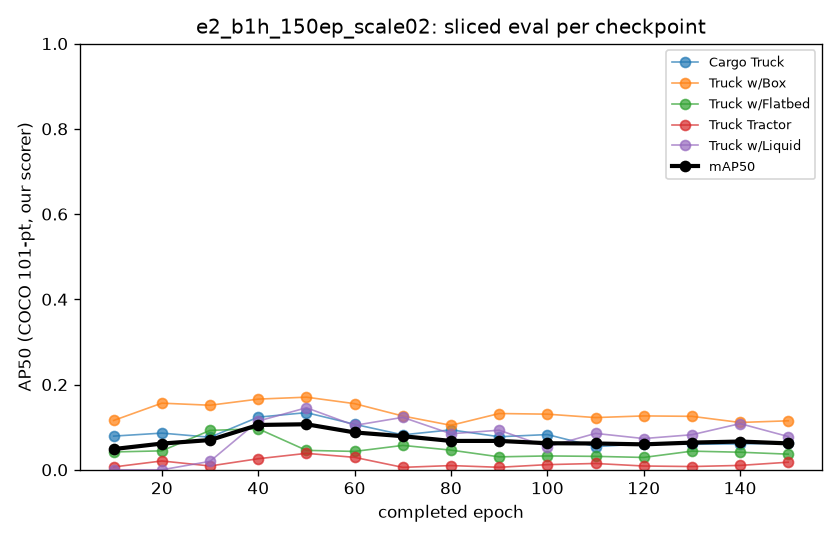
- 🧠 Not undertraining: overfitting.
- ➡️ Try remedies for overfitting (E3, E4).
- 📖 Details → [E1 / E2: Results](DETAILED_EXPERIMENTS.md#e1--e2-results-4-oct-2026)

### 9. ✅ CHECK 0: were any scores picked on val?
- ❓ Did any reported number come from the best checkpoint on val?
- 💡 Claude chat · ✅ Aradhya
- 🔧 Audit of every `metrics.json`, plus an early-stopping check on all runs.
- 📊 All scores use `last.pt`. Only **E1** stopped early, at epoch 145.
- 🖼️ (an audit; no picture)
- 🧠 One small val leak, through Ultralytics early stopping, now switched off.
- 📖 Details → [CHECK 0](DETAILED_EXPERIMENTS.md#check-0-4-oct-2026-which-weights-produced-the-reported-scores)

### 10. §5.2: which training examples resist learning?
- ❓ Which boxes never get learned, and why?
- 💡 Test-half confirmation suggested by Claude chat; claims C1–C5 derived by Claude Code from the inspect half · ✅ Aradhya
- 🔧 Track every training box across checkpoints; test five pre-registered claims on an unseen half.
- 📊 **All 5 claims hold.** About 78% of "never detected" boxes do get a box, just at low confidence.
- 🖼️ 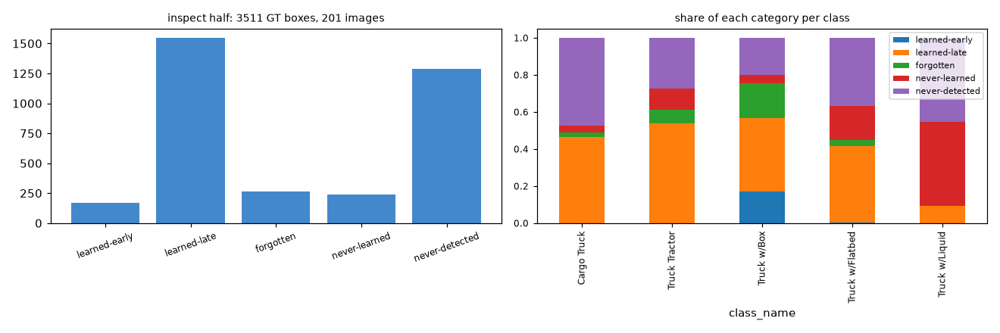
- 🧠 Small trucks; "never confident" rather than invisible; Box learned and then forgotten.
- 📖 Details → [§5.2 test-half confirmation: Results](DETAILED_EXPERIMENTS.md#52-test-half-confirmation-results-4-oct-2026-cpu-only-kernel-aradhya1211auric-s52-confirm-v2-code-95953f3)

### 11. Why is val harder than holdout40?
- ❓ Same model; why does it find fewer trucks on val?
- 💡 Claude chat · 🤖 built by Claude Code · ✅ Aradhya
- 🔧 Compare recall at matched box size, density and image size.
- 📊 Gap **0.187**. Box size explains only **3%** of it.
- 🖼️ 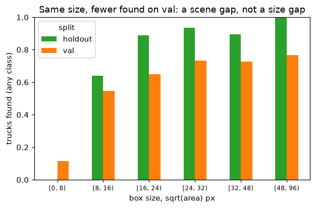
- 🧠 A scene-level shift. Domain shift is back as the leading explanation.
- 📖 Details → [Val vs holdout40 recall gap](DETAILED_EXPERIMENTS.md#val-vs-holdout40-recall-gap-4-oct-2026-cpu-only-kernel-aradhya1211auric-recall-gap-code-cc152a5)

### 12. E3 / E4: aerial pretraining, or more augmentation?
- ❓ Can we reduce overfitting?
- 💡 Claude chat · 🤖 built by Claude Code · ✅ Aradhya
- 🔧 E3: start from DOTA aerial weights. E4: vertical flips + mixup.
- 📊 Unseen: E3 **0.082**, E4 **0.130**, vs B1h 0.151.
- 🖼️ 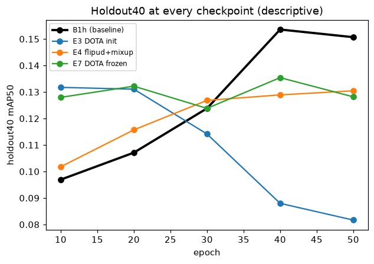
- 🧠 E3 memorises even faster. E4 overfits less and finds more trucks, but names them worse.
- ➡️ E7 (freeze E3's backbone), E8 (E4 for longer), two-stage on E4's boxes.
- 📖 Details → [E3: Results](DETAILED_EXPERIMENTS.md#e3-results-4-oct-2026-gpu-kernel-aradhya1211auric-e3-dota-code-734299d-164-gpu-h-kernel-time) · [E4](DETAILED_EXPERIMENTS.md#e4-results-4-oct-2026-gpu-kernel-aradhya1211auric-e4-flipud-mixup-code-734299d-184-gpu-h-kernel-time)

### 13. 🔍 Background false-positive audit
- ❓ Are the "false positives" really false?
- 💡 Claude chat · 🤖 built by Claude Code · ✅ Aradhya
- 🔧 The 60 most confident predictions with no matching label, looked at by eye.
- 📊 **46 of 60** look like real, unlabelled trucks.
- 🖼️ 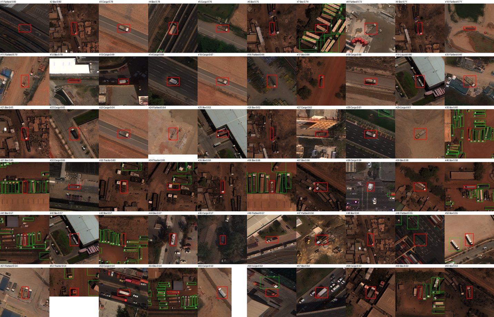
- 🧠 Either our five classes are missing from the labels, or these are truck types the dataset leaves out (pickups,
  utility trucks, trailers). The crops can't tell which. Either way, real vehicles count as errors, so the score
  understates the model. (One viewer, not blind, low resolution.)
- 📖 Details → [Background false-positive audit](DETAILED_EXPERIMENTS.md#background-false-positive-audit-4-oct-2026-cpu-only-kernel-aradhya1211auric-fp-crop-code-734299d)

### 14. Crop classifier: a second opinion on the truck type
- ❓ Can a dedicated classifier name trucks better than the detector?
- 💡 Claude chat · 🤖 built by Claude Code · ✅ Aradhya
- 🔧 A ResNet18 on truck crops re-labels B1h's boxes.
- 📊 61% accurate; re-labelled holdout drops to **0.100–0.117**.
- 🖼️ (figure pending)
- 🧠 No better than the detector's own head.
- 📖 Details → [Crop classifier on B1h](DETAILED_EXPERIMENTS.md#crop-classifier-on-b1hs-holdout40-detections-4-oct-2026-cpu-only-kernel-aradhya1211auric-fp-crop-code-734299d)

### 15. TTA: flips + upscale at test time
- ❓ Does averaging over flipped and upscaled copies help?
- 💡 Aradhya asked "can't we augment?" · design by Claude chat · ✅ Aradhya
- 🔧 Four views per tile, merged as usual.
- 📊 Holdout **0.138**, vs 0.151 without TTA.
- 🖼️ (figure pending)
- 🧠 The extra views add noisy boxes. Not supported.
- 📖 Details → [TTA on B1h: Results](DETAILED_EXPERIMENTS.md#tta-on-b1h-results-4-oct-2026-cpu-only-kernel-aradhya1211auric-tta-b1h-code-095cf9b)

### 16. E7: aerial weights with a frozen backbone
- ❓ Did E3 overwrite its aerial features?
- 💡 Claude chat · ✅ Aradhya
- 🔧 E3, but with the backbone frozen.
- 📊 Unseen **0.128**, vs E3's 0.082 and B1h's 0.151.
- 🖼️ 
- 🧠 Freezing undoes much of E3's damage, but it doesn't beat B1h (as predicted).
- 📖 Details → [E7: Results](DETAILED_EXPERIMENTS.md#e7-results-4-oct-2026-gpu-kernel-aradhya1211auric-e7-dota-frozen-code-e5a115e-120-gpu-h-kernel-time)

### 17. B1h's own holdout curve
- ❓ Does even the baseline overfit within 50 epochs?
- 💡 Claude chat · ✅ Aradhya
- 🔧 Score B1h's saved checkpoints on holdout40.
- 📊 Rises to **0.154** at epoch 40, **0.151** at epoch 50.
- 🖼️ 
- 🧠 Flat at the end, with no clear peak. B1h stops near the right time.
- 📖 Details → [B1h holdout40 checkpoint curve](DETAILED_EXPERIMENTS.md#b1h-holdout40-checkpoint-curve-descriptive-4-oct-2026-cpu-only-kernel-aradhya1211auric-b1h-holdout-curve-code-e5a115e)

---

## Plot twists & roadblocks 🎢
- ⏱️ **Colab free tier was too short** for the runs (Aradhya's screenshot). Everything moved to Kaggle, driven from the
  command line; CPU-only kernels for anything without a GPU (Claude chat's idea).
- 🧟 **Kaggle mounted stale code once.** A kernel ran the previous version, so the script was missing. Claude Code added a
  guard: every kernel checks its code commit first.
- 🐛 **The label checker cried wolf.** 85 tiles were flagged as mismatched; it was a pairing bug in the checker, found by
  Claude Code. After the fix: 0.
- ⏹️ **E1 stopped itself at epoch 145.** Ultralytics' default early stopping, watching val, found by Claude Code.
  Every later run turns it off.
- 🔢 **"500 instances" ≠ "500 images".** Our curve answered the wrong question; Claude Code caught it while building the
  checklist. Answer as asked: about +0.006, below noise.
- 📏 **§5.4 must be judged on val**, per the brief (also caught by Claude Code). Both versions are reported; neither
  finds a 90% subset.
- 🧮 **Kaggle GPU quota hold.** Running sessions reserve quota, and the command-line tool can't see that, so E8 waited
  until E6 and E7 both finished.
- 🎯 **"Can we reach 0.7?"** Aradhya asked. Claude chat checked published xView results on similar small, look-alike
  classes; they are far below 0.75 (Claude chat's check, not verified in this repo).
- 🧭 **"Picking an epoch on holdout40 isn't test-set selection."** A correction by Claude chat: holdout40 is our
  validation split. We still keep `last.pt`, as pre-registered.
- 🏃 **"Keep going nonstop."** Aradhya's call, which is why there are so many small experiments.
- 🤝 **AI-assistance disclosure.** Flagged by Claude chat, approved by Aradhya.

## Still running ⏳
- **E6, rare-class resampling.** Training finished, then crashed in a summary step; evaluation is running on CPU. Heads-up:
  at the pre-registered setting only Liquid gets repeated, so it's a weak test. 📖 Details → [E6: run record](DETAILED_EXPERIMENTS.md#e6-run-record-4-oct-2026-gpu-kernel-aradhya1211auric-e6-rfs-code-7ec3894)
- **E8, E4's recipe for 100 epochs.** Training on GPU. 📖 Details → [E8: E4](DETAILED_EXPERIMENTS.md#e8-e4s-recipe-for-100-epochs-pre-registered-4-oct-2026-before-any-run-configse8_b1h_flipud_mixup_100epyaml)
- **Two-stage on E4's boxes.** Running on CPU. 📖 Details → [Two-stage: crop](DETAILED_EXPERIMENTS.md#two-stage-crop-classifier-on-e4s-boxes-pre-registered-4-oct-2026-before-any-run)
- **E1 / E2 holdout curves.** Running on CPU. They will be added to the holdout-curve picture.
- **TTA / FP audit:** done (cards 13 and 15).
