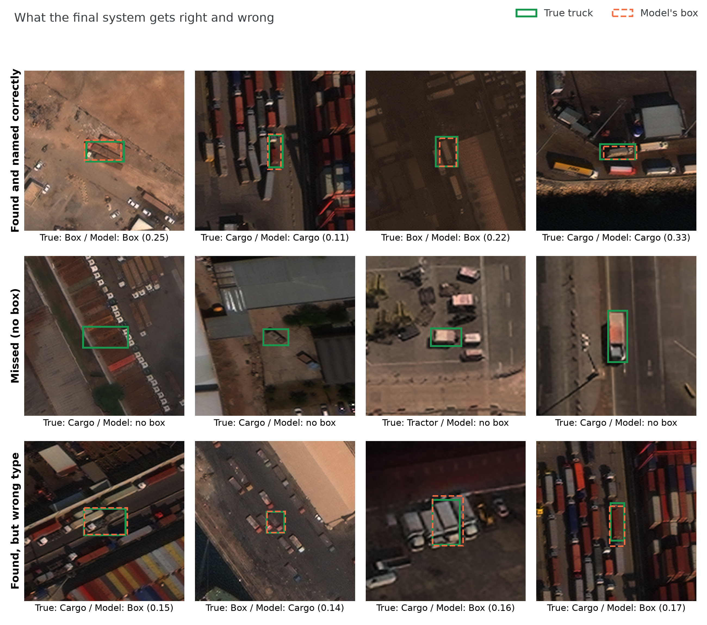

# Technical report: finding trucks in satellite photos (short version)

This is the short report. Every number here is taken from [docs/REPORT_FULL.md](docs/REPORT_FULL.md), which has the
sources, the full tables and every caveat. The run-by-run log, with each prediction written down before its result, is
[DETAILED_EXPERIMENTS.md](DETAILED_EXPERIMENTS.md).

> **Words used here**
> - **Score:** mAP50, the brief's metric, from 0 (nothing right) to 1 (perfect). A truck counts only if the box
>   overlaps it by at least half *and* the type is right.
> - **Official test:** the 22 supplied validation photos ("val"). Never used to train or to choose the final system
>   (one disclosed exception: E1's automatic early stopping; see docs/REPORT_FULL.md, Reproducibility).
> - **Practice test:** 40 training photos held back ("holdout40"), used for every choice. "Practice test, clean labels"
>   means the same 40 photos scored against the public xView originals' labels.
> - **Luck alone:** how much a score moves when the same recipe is trained twice: about **0.017** on the practice test
>   and **0.043** on the official test (one repeat). Smaller differences mean nothing.
> - **Tiles:** full-resolution squares cut from each photo. **Three models voting:** an ensemble whose answers are
>   combined box by box.

## Summary

**The target was missed by a wide margin.** The target was 0.75 on the official test.
- **Final system:** three models voting (the baseline plus two variants), selected on the practice test. It scores
  **0.1349** on the official test, scored once and reproduced in a clean environment.
- **Single-model baseline (B1h):** 0.1065 (95% CI 0.056–0.165). The same recipe trained again scored 0.0634.

*Score on the official test by stage: tiling is the only large step, and every stage is far below 0.75.*

Why, in order of evidence strength:
1. **It does not generalise from 403 photos.** The baseline scores 0.378 on photos it trained on, 0.151 on the practice
   test and 0.107 on the official test. Training 3× longer raised the first and lowered the second.
2. **Naming the type is the main loss, not finding the truck.** Fixing every wrong-type mistake would add +0.147;
   fixing every slightly-off box only +0.022.
3. **More photos help, but slowly.** 500 more labelled trucks project to about +0.006, below luck alone.
4. **The data has real problems, but they cost little.** 8 of 22 official-test photos were altered, and many "false
   alarms" are truck types the labels leave out. Correcting for all of it lifts the baseline only from 0.107 to 0.137.
5. **What helped, modestly:** three models voting, +0.032 on the practice test (clean labels), and 0.107 → 0.135 on
   the official test, which is within luck alone (0.043) there.

Compute: 26.49 GPU-hours this week (one Kaggle T4), plus an earlier week for the baselines. All diagnosis ran on CPU.

Details: docs/REPORT_FULL.md "Summary" and "The four questions".

## AI assistance

This project was built with AI help: Claude Code for code, analysis and drafting, and a chat assistant for planning
experiments. Predictions and decision rules marked "author's" in DETAILED_EXPERIMENTS.md were chosen and approved by
the author before each run; other interpretations were drafted by Claude Code and reviewed by the author. The brief
permits this, provided the author can explain and defend the work.

Details: docs/REPORT_FULL.md (top of the file).

## 2. Data and baselines

**The data.** 443 training photos (7,618 trucks) and 22 official-test photos (1,552 trucks).
- Photos are large (about 3,200 × 2,900 pixels) and trucks tiny: about 22 pixels across in training, 25.5 in the
  official test.
- Two types dominate: cargo and box are 81% of training trucks. Liquid tankers have only 20 trucks in the official
  test, so their score is very uncertain.
- The official test is much more crowded: 70.5 trucks per photo on average, against 17.2 in training.
- All photos turned out to come from the public xView dataset; this matters in §3.

**Baselines.**

| Step | What changed | Official test | Practice test |
|---|---|---|---|
| B0 | whole photo shrunk to 640 px | 0.0020 | – |
| B1 | cut into 1024-px tiles at full resolution | 0.0715 | – |
| B1h | as B1, with 40 photos held back as the practice test | 0.1065 | 0.1507 |

- **Tiling was the only large improvement.** Shrunk to 640 px, a 22-pixel truck becomes a few dots.
- **B1 → B1h is within luck alone.** Retraining B1h scored 0.0634 on the official test and 0.1333 on the practice test,
  a spread as large as the B1 → B1h difference.
- Caveat: B0 and B1 used the same number of passes but very different amounts of training (1,400 vs 11,850 steps).

Details: docs/REPORT_FULL.md §2.1–§2.4.

## 3. What the detector gets wrong

*Baseline on the official test: how much the score would rise if each kind of mistake were fixed.*

*Real examples from the official test (final system, confidence >= 0.10). Picked at random, not the best or worst.*

- **Wrong type is the biggest mistake (+0.147)**, then false alarms (+0.077), missed trucks (+0.044) and slightly-off
  boxes (+0.022). The bins overlap, so they don't add up to a ceiling.
- **Ignoring the type, the baseline scores 0.255** on the official test against 0.107 with the type. It finds trucks
  far better than it names them.
- **Cargo ↔ box is the most frequent mix-up.** In the final system, 111 cargo trucks were called box and 60 box trucks
  cargo. Tractor was named correctly for 5 of 117 trucks and liquid for 0 of 20.
- **Many "false alarms" are real trucks.** 46 of the 60 most confident unmatched boxes on the practice test look like
  real, unlabelled trucks (one viewer, not blind, top 60 only). 216 of 350 confident false alarms sit on xView trucks
  of types outside the five classes.
- **The official test is harder than the practice test.** The baseline finds 0.665 of official-test trucks against
  0.852 on the practice test. Truck size explains 3% of that gap. Brightness and contrast each explain about 31%, and
  these overlap; the rest is unexplained.
- **8 of 22 official-test photos were altered** compared with their xView originals: 4 resized 2× or 0.5×, 2 given noise
  or blur, 2 with changed contrast. All training photos are untouched.

Details: docs/REPORT_FULL.md §3.1–§3.4.

## 4. Experiments

Most experiments changed one thing from the baseline and had a prediction and decision rule written down first
(DETAILED_EXPERIMENTS.md marks which). Each was trained once.

*Photos it trained on (grey) vs the practice test (blue). The band is the baseline ± 0.017 (luck alone).*

| Experiment | Idea | Result (practice test unless noted) | Verdict |
|---|---|---|---|
| E1 | train 3× longer | 0.092 vs 0.151; trained-on photos 0.774 | not supported: memorises |
| E2 | 3× longer, gentler zoom | 0.111 vs 0.151; trained-on photos 0.906 | not supported |
| E3 | start from aerial-photo weights | 0.082 vs 0.151 | rejected: memorises faster |
| E4 | more photo variety (flips, mixing) | 0.130 vs 0.151 | lower by 0.020, just beyond luck alone; finds more trucks |
| E7 | aerial weights, frozen | 0.128 vs 0.151 (E3: 0.082) | lower by 0.023, just beyond luck alone |
| E6b | show rare types more often | 0.136 vs 0.151; rare types did not rise | not supported |
| E8 | E4 for longer | stopped at 68 of 100 passes for budget | no result |
| TTA | flips and 1.5x zoom at test time | 0.138 vs 0.151 | rejected (within luck alone) |
| Crop classifier | a separate type classifier | 61% vs the detector's 69% on the same trucks | not supported |
| Two-stage | that classifier on E4's boxes | 0.101 / 0.118 | fails its rule |
| E10 | teach the left-out truck types | 0.126 vs 0.151; false alarms halved | mAP not supported; excluded |
| E12 | adjust for resized photos | +0.0004 (within luck); official test 0.0906 | not adopted |
| E15 | train on xView's original labels | 0.153 vs 0.176 (clean labels) | not supported |
| **E13** | **three models voting** | **0.2086 vs 0.1765 (clean labels); official test 0.1349** | **supported; final system** |
| E16 | enlarge tiles 2× | 0.155 vs 0.176 (clean labels); +0.010 as a 4th voter | not supported |

*E2's score on the official test by training pass (shown for description only, never used to choose): it peaks at 50
passes and falls after.*

**Every model on the official test** (scored once each; per-type numbers in docs/REPORT_FULL.md §4.1):

| Model | Score | Model | Score |
|---|---|---|---|
| B0 | 0.0020 | E3 | 0.0881 |
| B1 | 0.0715 | E4 | 0.0761 |
| B1h (baseline) | 0.1065 | E6b | 0.0908 |
| B1h, trained again | 0.0634 | E7 | 0.0715 |
| E1 | 0.0680 | E10 | 0.0820 |
| E2 | 0.0620 | E15 | 0.0908 |
| E12 (rule on B1h) | 0.0906 | **Final system (E13)** | **0.1349** |

The learning-curve and subset runs are listed there too. E6, E8, E9, E11 and E16 have no official-test score: E16
failed its pre-registered selection rule (+0.010 < 0.017), and the others were superseded, stopped or cancelled.

Details: docs/REPORT_FULL.md §4, §4.1, §4.2.

## 5. The brief's four research questions

### 5.1 If every truck's location were given, how much error remains?

**Most of it: given perfect locations, the baseline names the right type only 60% of the time, against 52% for
always answering "cargo".**
- Method: read the model's own type scores at each true truck, so finding the truck no longer matters.
- On the practice test the gap is much wider: 69% against 44%.
- Fixing only location errors would lift the score to 0.129; fixing only type errors to 0.254.
- Main caveat: this measures this model's type-naming, not the best possible; and 22 photos give only 20 liquid and
  117 tractor trucks.

Details: docs/REPORT_FULL.md §5.1.

### 5.2 Which training examples resist learning, and why?

**Mostly small trucks that the model sees but is never confident about, not trucks it cannot see.**
- Every training truck was followed through training and sorted into learned early, learned late, forgotten, never
  named right and never found.
- Five claims were written down from half the photos and tested on the other, unread half. All five held.
- About 38% of training trucks are never found at the usual confidence, yet 78% of those get a correctly placed guess
  at very low confidence. Trucks under 16 px are never found far more often than trucks over 32 px (+0.63 in share).
- Main caveat: the explanation (size, low confidence, unstable cargo/box boundary, rare types) was written after the
  result.

Details: docs/REPORT_FULL.md §5.2.

### 5.3 Would 500 more labels materially help?

**No: 500 more labelled trucks project to about +0.006, below luck alone (0.017).**
- The score on the practice test rises with more photos (101 → 403), but slowly.

*Practice-test score against the number of training photos, with the 0.75 target.*

- 500 trucks is about 29 more photos (403 → 432). Even 500 more *photos* project only to about 0.215.
- Box benefits most; tractor barely moves.
- Main caveat: the projection is a curve fitted to four points and is flagged unreliable beyond the data; only its
  direction is trustworthy.

Details: docs/REPORT_FULL.md §5.3.

### 5.4 What is the smallest subset that keeps 90% of the score?

**None of the subsets we tested: the smallest that works is the full 403-photo training set.**
- The selection method (cover every type, then maximise variety) was declared before training and compared with
  random subsets of the same size.
- At 202 and 302 photos no subset, clever or random, reached 90% (0.128) on the practice test; the best reached 0.123.
- The clever subsets found more trucks than random ones, but they also simply contained more labelled trucks.
- Main caveat: the official-test version of the answer is weak, because luck alone there (0.043) is larger than the
  gap.

Details: docs/REPORT_FULL.md §5.4.

## 6. Final analysis

### 6.1 Main limitations

1. **Generalisation from 403 photos.** Every attempt to fit the training photos better made the practice-test score
   worse.
2. **Naming the type,** especially cargo vs box, and the rare tractor and liquid types.

*Final system: cargo ↔ box is the most frequent mix-up by number of trucks (111 and 60); rarer types are mislabelled
at even higher rates. Percentages are among trucks the model found and placed correctly; trucks it missed are not
counted.*

3. **Incomplete labels:** the score punishes some correct finds (§3).
4. **The official test differs from training:** altered photos and darker, lower-contrast scenes.
5. **Small sample:** 22 official-test photos, and every experiment trained once.

Details: docs/REPORT_FULL.md §6.1.

### 6.2 How strong is each conclusion?

| Conclusion | Strength |
|---|---|
| The limit is generalisation; training harder hurts | strongly supported (four runs, one training each) |
| Naming the type, not finding the truck, is the main loss | strongly supported on the official test |
| Small trucks are seen but not confidently, rather than invisible | strongly supported (tested on unread half) |
| Three models voting beats the baseline | supported on the practice test (+0.032); within luck on the official test |
| Labels leave out real trucks, and the score undercounts | supported; size of the effect not measured |
| The official test's scenes differ from training | plausible; partly explained by brightness/contrast |
| 500 more labels would not materially help | supported as projected, with extrapolation caveats |
| Rare-type resampling, original labels, 2× enlarging | not supported |

Details: docs/REPORT_FULL.md §6.2.

### 6.3 What changed most

- **Tiling (B0 → B1)** was the only large change: 0.002 → 0.0715.
- **Baseline → final system:** three models voting, 0.1065 → 0.1349 on the official test. It is the only change after
  tiling that beat luck alone on the practice test. Its practice-test numbers after choosing the checkpoints are
  optimistic, because the choice was made on that same set.

Details: docs/REPORT_FULL.md §6.3.

### 6.4 The next step, with one more day

**Relabel the 62 evaluation photos (22 official + 40 practice) properly**, adding the missing trucks and marking the left-out truck types as "don't
count". It is cheap (no GPU) and removes one known source of error from future comparisons. It is not expected to move
the score much: correcting the labels diagnostically predicts only about +0.02–0.03 for the baseline. Model changes
are weaker candidates: none of nine single-model changes beat the baseline.

Details: docs/REPORT_FULL.md §6.4.

### 6.5 Why 0.75 was not reached

- **Published results on similar data are far below 0.75:** the best we found reported, on 19 similar small xView
  vehicle types, is 0.3065 (arXiv 2104.11854, Table IV).
- **Even ignoring the type, the baseline reaches only 0.255** on the official test.
- **The data issues are real but small:** correcting all of them lifts the baseline from 0.1065 to 0.1371.
- **Simple 2× enlarging was tested (E16) and did not help;** learned super-resolution was not tested.
- What remains is the difficulty of telling apart look-alike trucks about 22 pixels across, from 403 photos.

Details: docs/REPORT_FULL.md §6.5–§6.7.

## 7. Deliverables

| Deliverable | Where |
|---|---|
| Final model (three checkpoints + checksums) | GitHub release `weights-final-v1`; command in [README.md](README.md) §5 |
| Baseline model | GitHub release `weights-b1h-v1` |
| Inference and scoring | `predict.py`, `eval.py`; clean-room run reproduced 0.1349 (`results/clean_repro_final/`) |
| Training code and configs | `train.py`, `configs/`, [docs/REPRODUCE.md](docs/REPRODUCE.md) |
| Environment | `requirements.txt`, `requirements-lock.txt` |
| Experiment records | [DETAILED_EXPERIMENTS.md](DETAILED_EXPERIMENTS.md), [EXPERIMENTS.md](EXPERIMENTS.md) |
| Requirement-by-requirement check | [docs/SUBMISSION_CHECKLIST.md](docs/SUBMISSION_CHECKLIST.md) |

Details: docs/REPORT_FULL.md §7.
